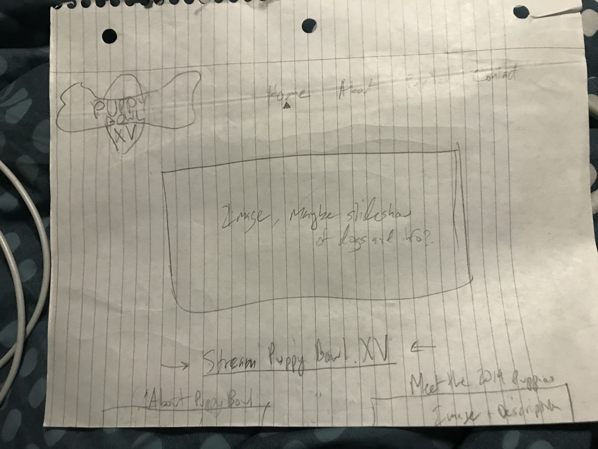

# Project 1: Design Journey

Your Name: Shea Murphy

**All images must be visible in Markdown Preview. No credit will be provided for images in your repository that are not properly linked in Markdown. Assume all file paths are case sensitive!**

# Project 1, Milestone 1 - Design & Plan

## Website Topic

I am going to be promoting Animal Planet's Puppy Bowl as an alternative to the Super Bowl.

## Target Audiences

My first target audience is dog lovers, and in this case even more specifically puppy lovers. This can include people of all genders and ages who have dogs or enjoy consuming dog related content.

My second target audience is families with kids who want an entertainment alternative for a superbowl party with kids. The age range for kids in the family would be 2-14, and the parents who might be searching could be any age or gender as well.

## Design Process

My design process started with rewatching large portions of the most recent Puppy Bowl to see the general branding used throughout, as well as to start documenting the various puppies featured, as well as other characters like the Referee and other animals. I then did some further online research and image aqcuisition.

After brainstorming with all the information I had gathered, I drew these sketches for each page, placing content where I think it belongs:

These sketches represent a very short but informed basic design/ ideation stage undertaken in the form of sketching until I was satisfied with both content layout and aesthetic for each page. I knew that to begin with, I wanted to have a page containing every puppy featured in the most recent broadcast, and I assumed that this would needto be on its own page so I started with sketching a page where each puppy would have a picture and information about the puppy itself. My original sketches had only two dogs per row, but after playing with the coded version of my website it ended up being easier to have more puppies per row. After this, I knew that I wanted to have a page that was dedicated to contacting the website, as well as some sort of home page and a page that held other various information regarding the Puppy Bowl. So, since the assignment was a 3 to 4 page site, I then began the creation of these other three pages. I drew a page that essentially housed my sticky form, another requirement of the assignment, and then drew an about page that held some basic about information. At this moment I realized that I didn't know where I would put the information regarding the referee or the other various members of the Puppy Bowl "staff". So, I decided to place this information on the about page after the blurbs of information on my sketches. I finished my sketching with the Home Page, which at this point only really needed to contain one item: the link to stream the Puppy Bowl from Animal Planet's website. Since this wasn't the best use of a single page, I also decided to place an "image or slideshow" on the front as well.

## Final Design Plan

My Final Sketches:

Site Navigation:

Home -
* Pictures showcasing the Puppy Bowl and its various puppies
* A link to stream the Puppy Bowl on the user's device
* Previews for other pages

About -
* A description of the Puppy Bowl
* The history of the Puppy Bowl
* Information on the non-puppy characters involved including the referee, assistant referee, team mascots, cheerleaders, and more

Puppies -
* Each puppies name
* An image of each puppy
* Any other information regarding the puppy that is provided by the Puppy Bowl stream or website

Contact -
* A form that has the capacity to record name, email, and a message if the user wants, as well as an option to sign up for a listserv that will serve as a reminder for the Puppy Bowl when it approaches in 2020

## Target Audiences' Needs

I am meeting my target audience needs in a few different ways. The "Meet the Puppy Bowl XV Puppies" page will be focused on information for those who are dog lovers, like breed mix and possible adoption information as well as images.  The About page will have information about the Puppy Bowl as a broadcast, and some information regarding why it is an amazing alternative to the Super Bowl. I will also have information to find a stream of the Puppy Bowl, and what other content can be found on the site accompanying it. Finally, I am going to have a contact page with a form on it, with the ability to send a message, and a checkbox if you want an email reminder next Super Bowl season of the resources to watch it.

## Templates

I will definitely be using a navigation bar template as well as a footer template.

# Project 1, Milestone 2 - Draft Website

## Sticky Form

In my sticky form, the name and email fields will be required.

My plan for error feedback is to just have "Please enter your name." and "Please provide a valid email address." respectively, using a bright color like red that doesnt fit with the rest of the color scheme. I might add a rectangle behind it if it makes it easier to read.

## Validation Code Plan

When the user tries to submit the form:
  If the name field is empty:
    Show feedback message "Please enter your name."
    Do not submit the form.
  If the email is empty:
    Show feedback message "Please provide a valid email address."
    Do not submit the form.
  Otherwise,
    Show no feedback message.
    Submit the form.

# Final Submission: Complete & Polished Website

## Target Audiences

My final website design is greatly influenced by my two target audiences. First of all, the home screen has a large, visible link to watch the Puppy Bowl, making it easy for anyone who is already looking for how to watch it to find it, and if my website successfully convinces someone to watch it instead of the Super Bowl, then they will know that there is a way to do so. The About page contains a lot of information regarding the event and the non-puppy characters. For my family audiences (possibly hosting a Super Bowl party), this page also houses a paragraph specifically arguing why the Puppy Bowl is a better option both for a party and for a family gathering. The Puppies page fills the needs of both those with young children who like to look at puppies and possibly get a feeling for what kinds of puppies are a part of the event, and for dog/ puppy lovers. The page houses rows of pictures and breed information about each puppy, which would be of interest to the dog enthusiasts. Finally, the contact page has a checkbox that allows members of either target audience to be reminded next Super Bowl season of the time to watch the Puppy Bowl, as well as methods to do so. Outside of content, I chose the colors to be close to the Puppy Bowl's color scheme but also to be easily legible for people of all ages. I also made most text slightly larger so that it is easier to read.

## Reflection

This assignment made me feel significantly more comfortable with PHP. When this class began, I thought that adding another language into the mix, especially one that sort of intertwined with HTML would cause me problems at least with my mental model of how things worked, but after gaining a better understanding how echo works in PHP through experimentation and the various lab exercises we did, I feel able to do much more in the realm of taking complicated hard coded sections and convert them to be procedurally generated using functions. Also, it helped me further hone my design skills and have a great refresher on how to throw together a quick prototype website that fits a set of sketches in just a few days, which is a very helpful real world skill.
